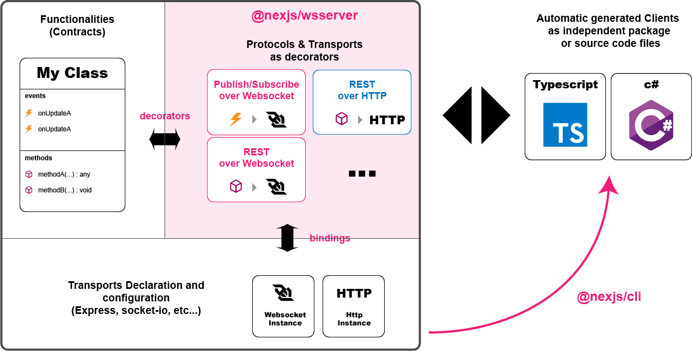

# @nexjs-ws

## Introduction

We use websocket as an Inter program or module communication protocol. I develop a custom protocol over Websocket that implement this 2 Patterns

* Request/Response Pattern
* Publish/Subscribe Pattern

We can response to almost any problems in a effective way with a combination of this 2 patterns:

* Synchronized calls
* Notifications by Events

## the idea

Separate in server the Functionality \(Contract\) from the call protocol and transport \(Rest API, Websocket TCP IP, HTTP, ...\) and create or update typed clients automatically. the main goals are

* Alway typed \(Client and Server\)
* Never implement a client
* Any update generate errors in code
* Separate functions \(contracts\) from transports and protocols. You van bind multiples protocols and transports on one server without code duplication.
* Realtime Applications: the combination of Publish/Subscribe and Rest is required for an easy implementation.
* Really simplified server code.
* Authentication separated from functionality



## Code overview 

* Only Implements the server
* automatic client generation \(ts or c\#\)

### server

```typescript
// ----------------------------------------------------------------------------
// [ Functionalities ]
class AContract {

  // [ decorators ]
  @Hub({ service: 'aContract', ...}) // Publish/Subscribe Protocol over websocket
  onUpdate = new HubEvent();         // Emitter custom class - only to unificate 
                                     // event system

  // [ decorators ]
  @Rest({ service: 'aContract',...}) // Request/Response Protocol over websocket
  methodA(): Promise<void>{
    // anything                      // Can return anything
  }  
}

// ----------------------------------------------------------------------------
// main.ts

const ioServer = ... // socket.io initialization 

// [ the binding ]
const wss = new WSServer<User, Token>();  // create Websocket protocols
wss.register(new AContract ());           // register class 
wss.init(new SocketIOServer(ioServer));   // initialize with a socket.io server

```

### cli \(typed api client creation\)

```typescript
// ----------------------------------------------------------------------------
// in command line (create api client)
npm install @nexjs/cli -g
nexjs ts ws up-client -s ./[server-folder] -o ./[client-folder]/[api-folder]

```

### client

```typescript
// ----------------------------------------------------------------------------
// in client (after automatic generation)
const wsapi = new WSApi<User, Token>(new SocketIOClient()); // create client

// [Publish/Subscribe] protocol
// 1. register event Handler
wsapi.aContract.onUpdate.on(() =>
  console.log(`onUpdate`) // 
);
// 2. Subscribe to event
await wsapi.baseContract.onUpdate.sub();

// [Request/Response]  protocol 
await wsapi.baseContract.methodA();

//That's all !!! 
```


## Repositories

### npm pakages

| Repository name | Links | Description |
| :--- | :--- | :--- |
| @nexjs/wsserver | [github](https://github.com/Juancoll/nexjs-wsserver), [npm](https://www.npmjs.com/package/@nexjs/wsserver) | Server Decorators and Bindings Class |
| @nexjs/wsclient | [github](https://github.com/Juancoll/nexjs-wsclient), [npm](https://www.npmjs.com/package/@nexjs/wsclient) | Client Base Class \(required by all clients\) |
| @nexjs/cli | [github](https://github.com/Juancoll/nexjs-cli), [npm](https://www.npmjs.com/package/@nexjs/cli) | Command line to generate/update Clients |

### Dev repositories

| Repository name | Link | Description |
| :--- | :--- | :--- |
| nexjs-ws.dev.server | [github](https://github.com/Juancoll/nexjs-ws.dev-project.server) | Project with @nexjs/wsserver as source code \(debuggable\) |
| nexjs-ws.dev.client | [github](https://github.com/Juancoll/nexjs-ws.dev-project.client) | Project with @nexjs/wsclient as source code \(debuggable\) |

### Demo repositories

| Repository name | Link | Description |
| :--- | :--- | :--- |
| nexjs-ws.demo.server.base | [github](https://github.com/Juancoll/nexjs-ws.demo-project.server-base) | minimal express server  |
| nexjs-ws.demo.server.nestjs | [github](https://github.com/Juancoll/nexjs-ws.demo.server.nestjs) | nestjs, mongoDb |
| nexjs-ws.demo.client.vue | [github](https://github.com/Juancoll/nexjs-ws.demo.client.vue) | minimal client |
| nexjs-ws.demo.client.vuetify | [github](https://github.com/Juancoll/nexjs-ws.demo.client.vuetify) | client with auth, http api and ws api |
| nexjs-ws.demo.client.nuxt | [github](https://github.com/Juancoll/nexjs-ws.demo.client.nuxt) | client with auth, http api and ws api |


